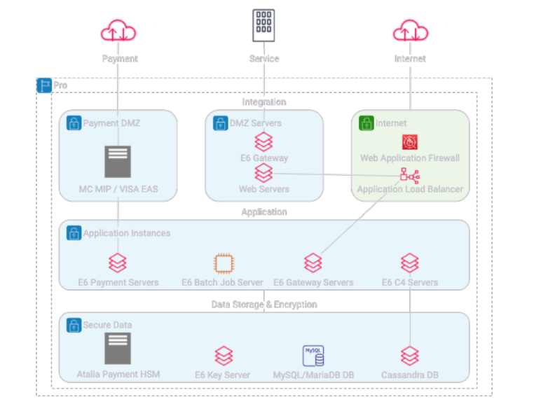

# onp.base.template

## Metadata
| attribute               | value                                         |
| ----------------------- | --------------------------------------------- |
| pattern-id              | onp.base.template                             |
| pattern-name            | base template                                 |
| pattern-version         | 1.0.0                                         |
| pattern-description     | "The integration domain consists of multiple subnets that are firewall separated and serve different purposes. Payments Demilitarized Zone (DMZ) subnet is used to the Mastercard Interface Processer (MIP), Visa EA server, and other payment network endpoints. A separate subnet hosts web servers that are used to serve static content for the Tritium Control Console customer service tool.
"                         |
| organisation-id         | e6                                            |
| pattern-categories      | bootstrap                                     |

## What is this pattern?
This pattern is a basic template, modify it as you see fit

